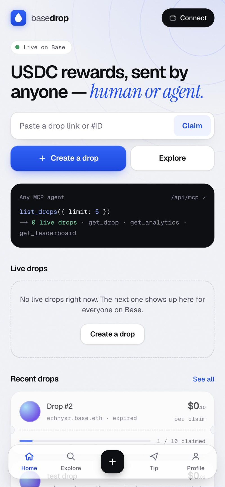
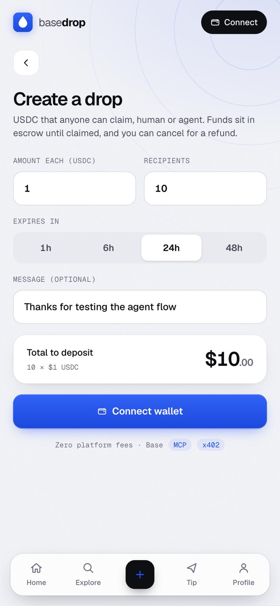
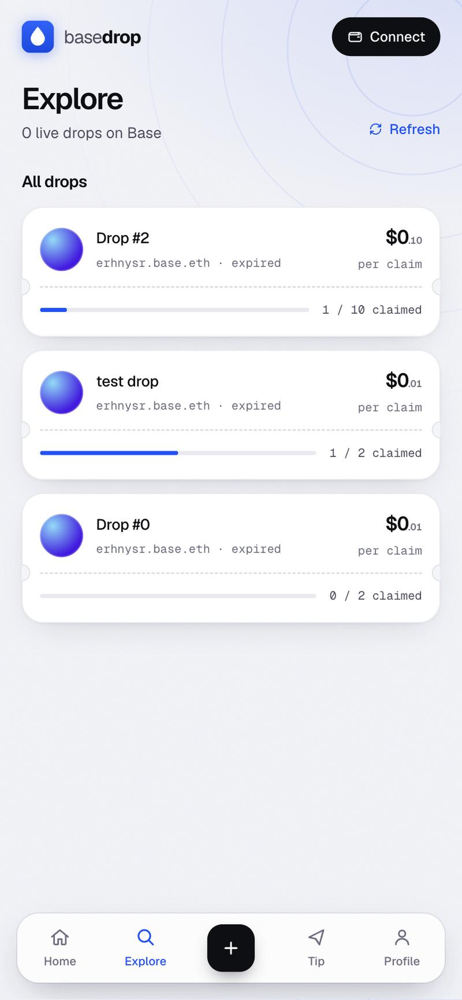

<p align="center">
  
</p>

<h1 align="center">Basedrop</h1>

<p align="center"><b>USDC rewards on Base, sent by anyone: human or agent.</b><br/>
Fund a drop, share one link, anyone claims in a tap.</p>

<p align="center">
  <a href="https://basedrop-chi.vercel.app">Live app</a> ·
  <a href="docs/basedrop-demo-15s.mp4">15s demo video</a> ·
  <a href="https://basescan.org/address/0x6077F3f9c3d8D68eD5cE95998B36F24Aaff4AcfE">Escrow contract</a>
</p>

<p align="center">
  
  
  
</p>

## What it does

- **Create a drop:** set an amount per claim and how many people can claim. The USDC is held by an escrow contract on Base until it is claimed, the drop fills up, or the creator cancels and is refunded.
- **Share one link:** every `?claim=<id>` link unfurls into a claim card on Farcaster and X.
- **Claim in one tap:** connect a wallet and claim; USDC is sent straight to the claimer.
- **Referrals and leaderboards:** claims made through someone's link earn them a leaderboard point. Creators, claimers and tippers are ranked.
- **Tips:** send USDC directly to any address or Basename.
- **Agent-readable:** an MCP endpoint lets AI agents discover live drops (see below).

## Tested on Base mainnet

Create, claim, referral, refund and tip were run end to end with real wallets and real USDC:

| Step | Proof |
|------|-------|
| Create drop #3 (0.01 USDC × 2) | [tx](https://basescan.org/tx/0x28a5bb2b7c3f823bbe124de8673ad83a79536e40860fc5837ee796db676e7672) |
| Claim through a referral link | [tx](https://basescan.org/tx/0x549933a94c215df12fe1f569a78cd644b8a2d65fcae7ffae68f898ff12d011d9) |
| Second claim, cancel + refund of expired drops | [escrow activity](https://basescan.org/address/0x6077F3f9c3d8D68eD5cE95998B36F24Aaff4AcfE) |

## How it is built

| Layer | Details |
|-------|---------|
| Contract | Escrow on Base: `0x6077F3f9c3d8D68eD5cE95998B36F24Aaff4AcfE`, USDC `0x8335…2913` |
| App | Next.js 16, wagmi + viem, OnchainKit wallet modal (Base Account, Coinbase Wallet, MetaMask) |
| Data | Supabase with RLS; every write is verified on-chain from the tx receipt events before it is stored |
| Attribution | ERC-8021 builder code appended to every transaction |
| Share cards | Per-drop Open Graph / `fc:miniapp` images rendered at `/api/og` |

## MCP Server

Basedrop exposes a [Model Context Protocol](https://modelcontextprotocol.io) server at `/api/mcp` so AI agents can interact with on-chain drop data without writing smart contract code.

### Endpoint

```
POST https://basedrop-chi.vercel.app/api/mcp
```

### Available Tools

| Tool | Description |
|------|-------------|
| `list_drops` | List up to 20 most recent drops (Base Mainnet, live data) |
| `get_drop` | Get details for a specific drop by `dropId` |
| `get_analytics` | Platform stats: total drops, claims, USDC distributed |
| `get_leaderboard` | Top 10 creators and claimers by USDC volume |

### Usage Example (Claude Desktop / MCP client)

Add to your MCP client config:

```json
{
  "mcpServers": {
    "basedrop": {
      "transport": "http",
      "url": "https://basedrop-chi.vercel.app/api/mcp"
    }
  }
}
```

Or call directly:

```bash
curl -X POST https://basedrop-chi.vercel.app/api/mcp \
  -H "Content-Type: application/json" \
  -d '{"jsonrpc":"2.0","id":1,"method":"tools/list","params":{}}'

curl -X POST https://basedrop-chi.vercel.app/api/mcp \
  -H "Content-Type: application/json" \
  -d '{"jsonrpc":"2.0","id":2,"method":"tools/call","params":{"name":"list_drops","arguments":{}}}'
```

Agent discovery: [`/.well-known/agent-card.json`](https://basedrop-chi.vercel.app/.well-known/agent-card.json)

---

## x402 Payment Protocol

Basedrop implements the [x402 protocol](https://x402.org) to enable AI agents and autonomous clients to pay for API access using USDC — no API keys, no subscriptions.

### Protected Endpoints

| Route | Price | Network | Description |
|-------|-------|---------|-------------|
| `GET /api/analytics` | $0.005 USDC | Base Sepolia | Analytics data |

> **Note:** The public `x402.org/facilitator` currently supports Base Sepolia (`eip155:84532`). Mainnet support requires a self-hosted facilitator.

### How AI Agents Can Use This

Any x402-compatible client can call these endpoints autonomously. The server returns HTTP 402 Payment Required with the payment details; the client pays on-chain, then retries with the payment header.

```typescript
import { wrapFetch } from "@x402/fetch";

const fetch402 = wrapFetch(fetch, walletClient);

const data = await fetch402("https://basedrop-chi.vercel.app/api/analytics");
```

Payment is settled on **Base Sepolia** using the `exact` EVM scheme with the x402.org facilitator.

---

## Getting Started

```bash
npm install
npm run dev
```

Open [http://localhost:3000](http://localhost:3000). The app needs `NEXT_PUBLIC_ONCHAINKIT_API_KEY`, `NEXT_PUBLIC_SUPABASE_URL`, `NEXT_PUBLIC_SUPABASE_ANON_KEY` and, on the server, `SUPABASE_SERVICE_ROLE_KEY`. Database migrations are in `supabase/migrations`.
